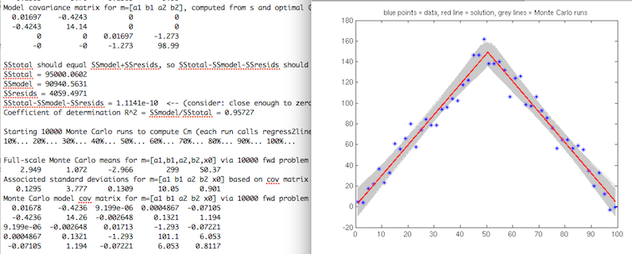

MultiRegressLines.matlab, 2002-2015  
Andy Ganse, Applied Physics Laboratory, University of Washington  
aganse@apl.washington.edu  

MultiRegressLines includes the Matlab script regress2lines.m that
runs a two-line-segment regression on a dataset of X,Y data.
Sometimes called "multi-phase linear regression" in the literature,
the idea is that N linear segments are joined at their endpoints so
that the procedure must estimate not only N standard linear
regressions but also the locations of the join point (N=2 here).
Unlike the present Java version of the algorithm, this one is
mathematically correct and also provides uncertainty analysis of
the solution.  From regress2lines.m one could create a
regress3lines.m script - I may do that in future.  Meanwhile, in
addition the second script stats_regress2lines.m runs a Monte Carlo
analysis to explore the estimate uncertainties in solving for the
line parameters and join point (Monte Carlo because the problem is
nonlinear).

Please see my webapge explaining the details of this topic:
http://staff.washington.edu/aganse/mpregression/mpregression.html
